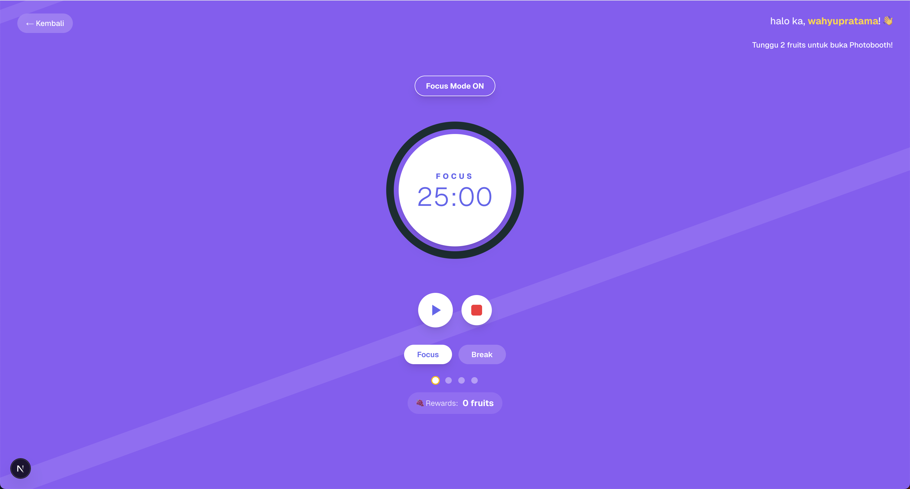

# Pomodoro + Photobooth

A playful Pomodoro timer with a built-in photobooth and customization panel. Built with Next.js App Router and a candy-like UI.

<div style="display:flex; gap:16px; flex-wrap:wrap; align-items:center; justify-content:center;">
  
  
  
</div>

## Highlights

- Pomodoro timer with playful visuals and interactions.
- Photobooth mode to take 4 photos, add stickers, and download the final strip.
- Full customization: frame color, text color, patterns, and photo shapes.
- Smooth transitions and polished UI details.

## Tech Stack

- Next.js (App Router)
- React + TypeScript
- Tailwind CSS

## Getting Started

Install dependencies:

```bash
npm install
```

Run the development server:

```bash
npm run dev
```

Open `http://localhost:3000` in your browser.

## App Flow

1. Start at the landing screen.
2. Enter Pomodoro mode to focus and earn access to Photobooth.
3. Switch to Photobooth, take 4 shots, and customize your photo strip.
4. Download the final image.

<div style="display:flex; gap:12px; flex-wrap:wrap; align-items:center;">
  
  
  
</div>

## Photobooth Customization

- Frame Color: pick from presets or use custom color.
- Text Color: choose the caption color.
- Patterns: apply background textures.
- Photo Shape: swap the cutout style.
- Stickers: add/remove stickers on photos or the frame.

## Project Structure

```text
src/
  app/
    photobooth/        # Photobooth page + layout
    content/           # Main app view
  components/
    atoms/             # Small UI elements
    organisms/         # Complex sections (Camera, Frame, Controls)
  lib/                 # Data + helpers
  types/               # App types
public/
  awal.png
  pomodoro.png
  photobooth.png
```

## Scripts

```bash
npm run dev      # Start dev server
npm run build    # Production build
npm run start    # Run production server
npm run lint     # Lint the project
```

## Assets

All images used in the README are stored in `public/`:

<div style="display:flex; gap:16px; flex-wrap:wrap; align-items:center;">
  
  
  
</div>
